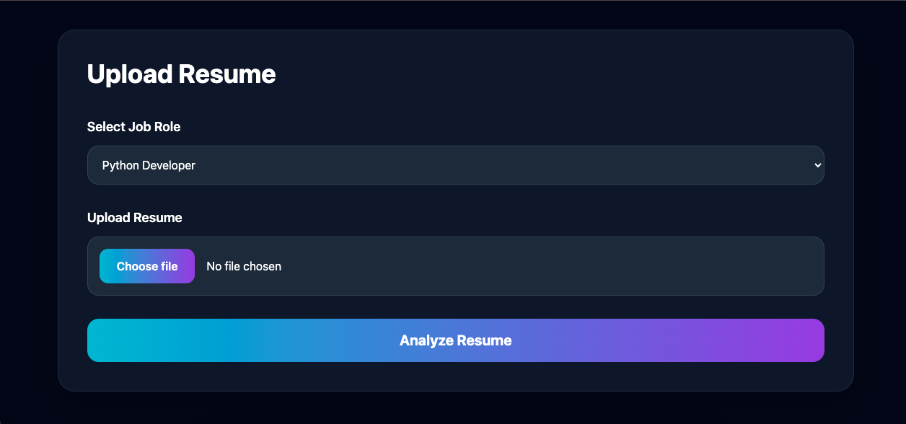
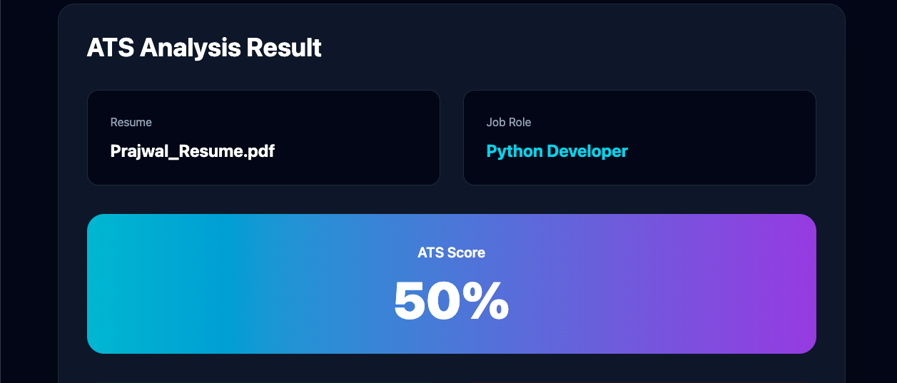
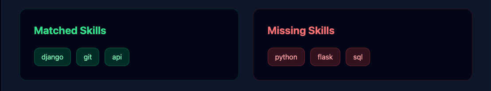

# AI Resume Analyzer

AI Resume Analyzer is a modern ATS (Applicant Tracking System) based web application built using Django and Python. The platform helps recruiters and hiring teams evaluate resumes efficiently by extracting content from PDF resumes, analyzing candidate skills against job-specific requirements, calculating ATS compatibility scores, and identifying skill gaps.

The application provides automated resume screening, role-based skill matching, and an intuitive user interface designed to simplify the recruitment process.

---

# Live Demo

https://ai-resume-analyzer-d3ix.onrender.com/

---

# Features

* Upload PDF resumes
* ATS score calculation
* Job role based evaluation
* Skill matching analysis
* Missing skills detection
* PDF text extraction
* Real-time resume processing
* Responsive modern UI
* Cloud deployment using Render

---

# Technologies Used

## Backend

* Python
* Django

## Frontend

* HTML5
* Tailwind CSS
* JavaScript

## PDF Processing

* PDFPlumber

## Deployment & Server

* Render
* Gunicorn
* WhiteNoise

## Version Control

* Git
* GitHub

---

# Project Structure

```bash id="readme1"
AI-Resume-Analyzer/
│
├── core/
├── resume_checker/
│   └── screenshots/
│
├── templates/
├── static/
├── manage.py
├── requirements.txt
├── README.md
└── .gitignore
```

---

# Project Screenshots

## Upload Resume



---

## ATS Analysis Result



---

## Skill Matching Analysis



---

# Installation Guide

## Clone Repository

```bash id="readme2"
git clone https://github.com/Yashwanthx03/AI-Resume-Analyzer.git

cd AI-Resume-Analyzer
```

---

## Create Virtual Environment

### Windows

```bash id="readme3"
python -m venv venv

venv\Scripts\activate
```

### Mac/Linux

```bash id="readme4"
python3 -m venv venv

source venv/bin/activate
```

---

## Install Dependencies

```bash id="readme5"
pip install -r requirements.txt
```

---

## Run Development Server

```bash id="readme6"
python manage.py runserver
```

Application will run at:

```bash id="readme7"
http://127.0.0.1:8000/
```

---

# Deployment

This project is deployed using Render.

## Build Command

```bash id="readme8"
pip install -r requirements.txt
```

## Start Command

```bash id="readme9"
gunicorn core.wsgi
```

---

# Challenges Faced

During development and deployment, the following challenges were resolved successfully:

* Django template configuration issues
* PDF extraction handling
* ATS score calculation logic
* GitHub repository setup
* Render deployment issues
* Gunicorn configuration
* DisallowedHost errors
* Static file management

---

# What I Learned

Through this project, I learned:

* Django project structure
* File upload handling
* PDF processing using PDFPlumber
* ATS scoring logic
* Skill matching systems
* Tailwind CSS UI development
* Git and GitHub workflow
* Render deployment
* Debugging production issues
* Full-stack project development

---

# Author

### Yashwanth

GitHub:
https://github.com/Yashwanthx03

